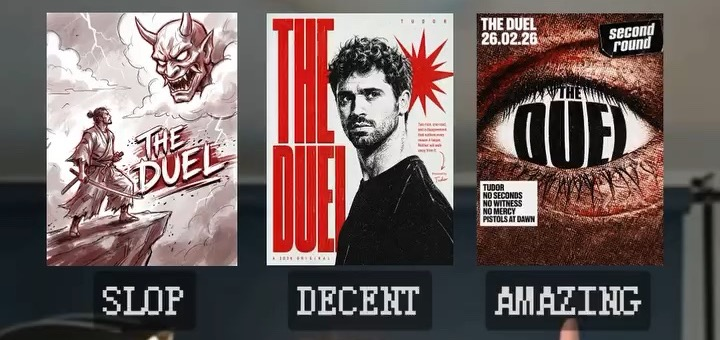
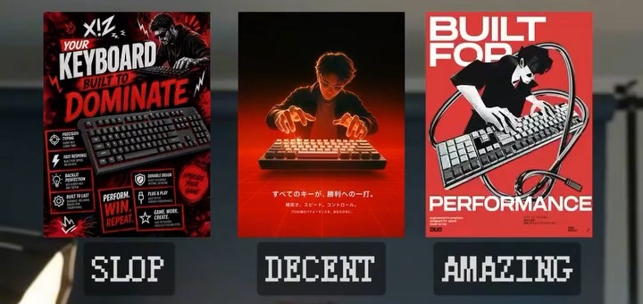
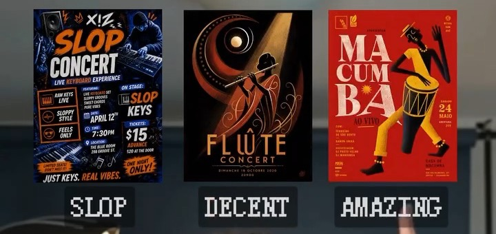
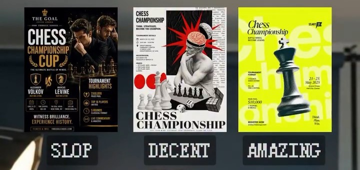
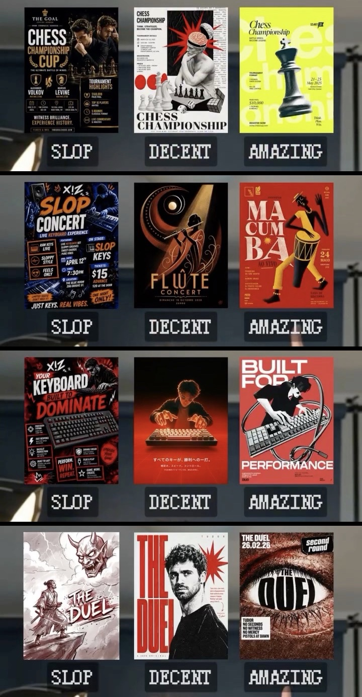

# Anti-Slop Design Director (TrueSpace)

> Режим арт-директора для ChatGPT от TrueSpace: одна строка — и нейросеть делает постеры, баннеры и обложки как дизайн-студия.

Копия страницы [truespaceai.ru/design/](https://truespaceai.ru/design/) со всеми исходными текстами, изображениями и правилами для нейросетей.

## Как использовать

Скопируй в ChatGPT строку:
> «Открой truespaceai.ru/design и включи режим арт-директора»

Или вставь содержимое файла [`design.txt`](design.txt) прямо в окно чата нейросети.

---

## Референсы

| Референс 01 | Референс 02 |
| :---: | :---: |
|  |  |
| **DUEL** | **KEYBOARD** |

| Референс 03 | Референс 04 |
| :---: | :---: |
|  |  |
| **CONCERT** | **CHESS** |

### Общая доска референсов

---

## Файлы репозитория

- `index.html` — основная веб-страница (готова к GitHub Pages).
- `design.txt` — чистый текст инструкции для копирования в ChatGPT.
- `images/` — оригинальные графические материалы и референсы.
- `design/` — дублирующая структура путей для совместимости с URL `/design/`.

---

Создано на основе материалов сообщества [TrueSpace](https://truespaceai.ru/).
