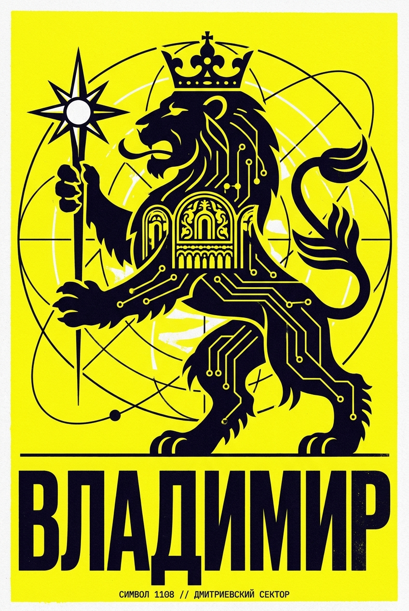

# Anti-Slop Design Director (TrueSpace)

> Режим арт-директора для ChatGPT от TrueSpace: одна строка — и нейросеть делает постеры, баннеры и обложки как дизайн-студия.

Копия страницы [truespaceai.ru/design/](https://truespaceai.ru/design/) со всеми исходными текстами, изображениями и правилами для нейросетей.

**🌐 Онлайн-версия на GitHub Pages:** [https://giddammit-crypto.github.io/truespace/](https://giddammit-crypto.github.io/truespace/)

---

## 🎨 Созданные постеры в режиме арт-директора

### 1. Нейросети в библиотечной работе
> **Концепт:** Персональный графический постер на основе фото автора в очках и кепке, встроенный в монументальный архив знаний будущего.  
> **Ссылка:** [vk.ru/libraryai](https://vk.ru/libraryai)

---

### 2. Футуристический Владимир
| Концепт 01: Золотые Ворота | Концепт 02: Владимирский Лев |
| :---: | :---: |
|  |  |
| **Орбитальный стартовый комплекс 1108** | **Дмитриевский сектор и геральдический лев** |

---

## Как использовать

Скопируй в ChatGPT строку:
> «Открой truespaceai.ru/design и включи режим арт-директора»

Или вставь содержимое файла [`design.txt`](design.txt) прямо в окно чата нейросети.

---

## Референсы оригинальной инструкции

| Референс 01 | Референс 02 |
| :---: | :---: |
|  |  |
| **DUEL** | **KEYBOARD** |

| Референс 03 | Референс 04 |
| :---: | :---: |
|  |  |
| **CONCERT** | **CHESS** |

### Общая доска референсов

---

## Файлы репозитория

- `index.html` — основная веб-страница (готова к GitHub Pages).
- `design.txt` — чистый текст инструкции для копирования в ChatGPT.
- `images/` — оригинальные материалы и созданные постеры.
- `design/` — дублирующая структура путей для совместимости с URL `/design/`.

---

Создано на основе материалов сообщества [TrueSpace](https://truespaceai.ru/).
